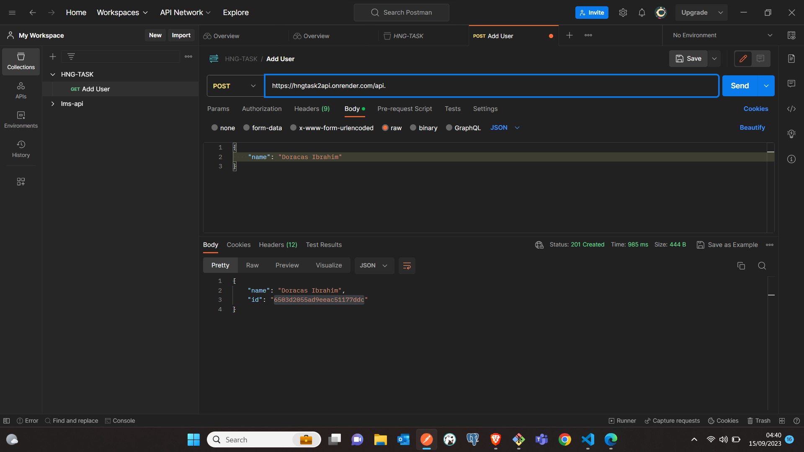
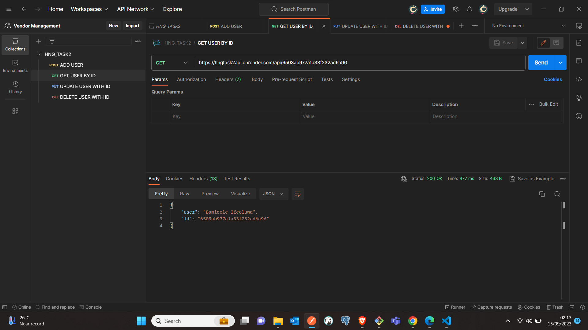
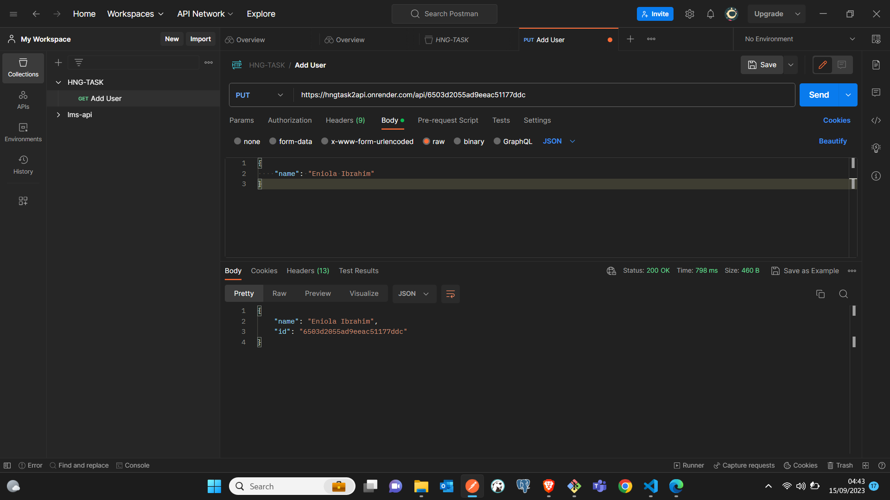
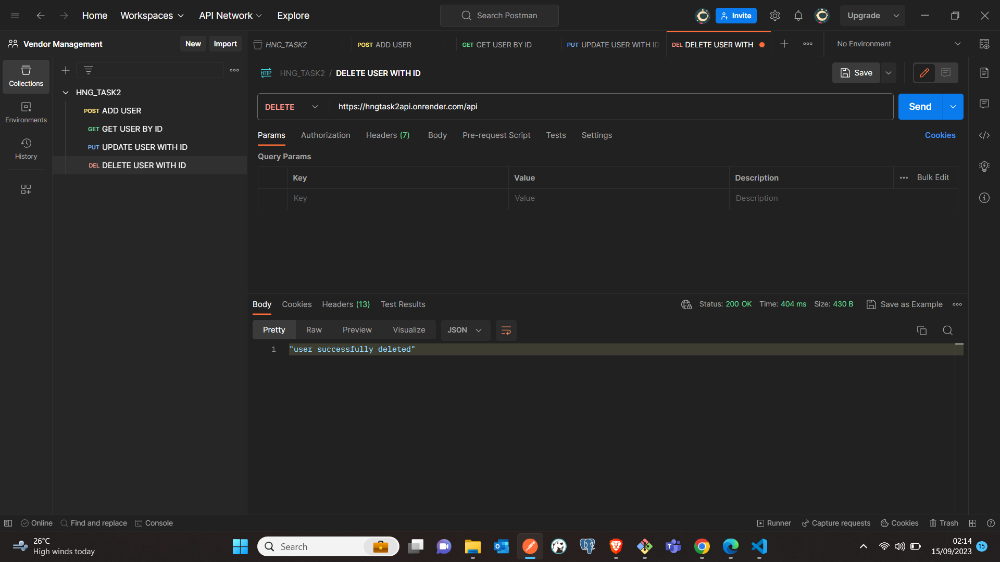

# LIVE ENDPOINT AT

[https://hngtask2api.onrender.com/api]

# FULL API DOCUMENTATION AND TESTING URL AT:

[https://api.postman.com/collections/9115404-08746c71-de86-490b-b10d-5623840c3017?access_key=PMAT-01HABFGGJSCB60FXG8PN2RNP6G]

# TASK BREAKDOWN

Objective: Build a simple REST API capable of CRUD Operation on a resources say "person".The choosen programming language should interface with any choosen databse of your choice

# WHAT YOU WILL LEARN ?

What will you learn by doownloading my project is?

1.  use of express to make Api creation simple
2.  Using mongose to manage database with MONGODB
3.  Validation of name using Joi
4.  Creation of Functional name using Rest Api with nodejs ,express and mongo

# HOW TO RUN THE PROJECT

Step1: Clone the repo and cd into the base folder

Step2: Installing Depencies
Run "yarn" to install dependencies

Step3: Launch your project
To launch the project ,you wiil type "yarn dev"
.The Api will run on port 3000

Step4:Test the Api endpoint
This is an api that manage user name .A user is characterized by
name:The name of the user
id: The unique identity of a user

# THE API HAS 4 ROUTES

1. Add User

   /api

2. Get User by id

   /api/:id

3. Update User

   /api/:id

4.Delete User
/api/:id

# EXAMPLE OF API TEST WITH POST MAN (IN PICTURE)

# ADD USER

# GET USER

# UPDATE USER

# DELETE USER

